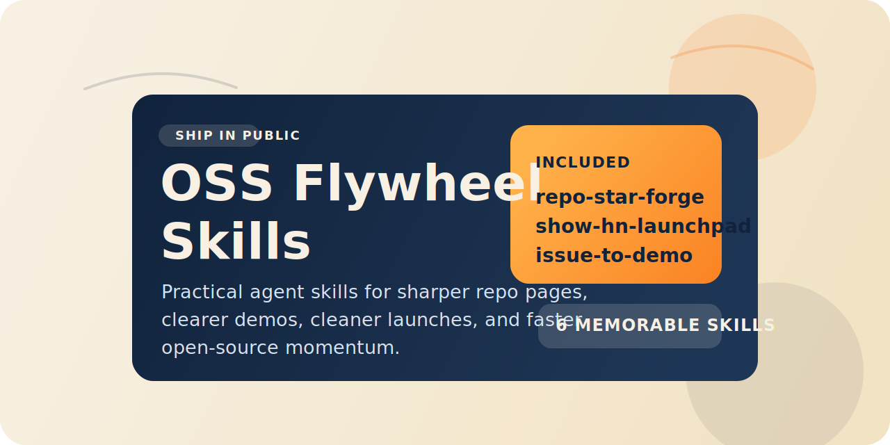

# OSS Flywheel Skills

Practical Codex-compatible skills for turning open-source work into demos, launches, sharper repo pages, and contributor momentum.


Built for indie hackers, open-source maintainers, and small product teams.

If your repo already has code but still lacks momentum, this collection helps convert the work into the assets that actually compound: a stronger README, clearer demo proof, better launch copy, and a friendlier contributor ramp.

## Why People Star Repos

Most stars do not come from "growth hacks." They come from a tighter loop:

1. A visitor lands on the repo.
2. They understand it fast.
3. They see proof that it works.
4. They share it, try it, or contribute.

These skills are designed for that loop.

## Quick Install

Clone the repository:

```bash
git clone https://github.com/daewoochen/oss-flywheel-skills.git
cd oss-flywheel-skills
```

Install one skill or the full set into Codex's default user skill directory:

```bash
./scripts/install.sh list
./scripts/install.sh repo-star-forge
./scripts/install.sh show-hn-launchpad
./scripts/install.sh all
```

By default the script links skills into `${CODEX_HOME:-$HOME/.codex}/skills`. If you want a custom destination:

```bash
./scripts/install.sh repo-star-forge /path/to/custom/skills
```

## Start Here

- Use `repo-star-forge` when your repo is technically solid but not converting visitors.
- Use `issue-to-demo` when you need a 30 to 60 second proof asset before posting publicly.
- Use `show-hn-launchpad` when the build is ready but the launch message is still fuzzy.

## Skills

| Skill | What it helps with | Example prompt |
| --- | --- | --- |
| `repo-star-forge` | Audit a repo page for star conversion and fix the highest-leverage blockers | `Use $repo-star-forge to rewrite this README so a first-time GitHub visitor understands the value in 20 seconds.` |
| `show-hn-launchpad` | Package a launch for Show HN, Product Hunt, X, and Reddit without sounding fake | `Use $show-hn-launchpad to turn this release into a Show HN post kit.` |
| `issue-to-demo` | Turn an issue, feature, or spec into a demo story, shot list, and proof assets | `Use $issue-to-demo to turn this feature into a 45-second demo plan.` |
| `readme-rescue` | Rewrite confusing or boring README files into faster activation paths | `Use $readme-rescue to rebuild this README around quickstart and examples.` |
| `contributor-ramp` | Make a project easier for first-time contributors to join and stick with | `Use $contributor-ramp to create a better first-hour contributor experience.` |
| `changelog-to-hype` | Turn raw commits and PRs into release notes and distribution copy | `Use $changelog-to-hype to convert the last release into notes, a thread, and a short post.` |

You can also symlink individual skill folders manually into any standard Agent Skills location such as `~/.codex/skills` or `.agents/skills`.

## Why This Collection

A lot of public skill repositories are either too generic or too infrastructure-heavy for solo builders. This one stays close to the moments that create visible momentum:

- README pages that explain value faster
- Demos that make a feature feel real
- Launch kits that do not sound fake
- Onboarding flows that turn attention into contributors

## Structure

Each skill stays small and follows the Agent Skills pattern:

```text
skills/<skill-name>/
├── SKILL.md
├── agents/openai.yaml
└── references/
```

`SKILL.md` contains the workflow. `references/` contains only the extra details that are worth loading on demand.

## Contributing

Open an issue or PR with one strong skill instead of a giant dump of prompts. The bar is:

- Clear trigger conditions
- Outputs that save real time
- Minimal fluff
- Honest, high-signal workflow

## Inspiration

This repo was shaped by patterns that are working in public skill collections, especially:

- [huggingface/skills](https://github.com/huggingface/skills)
- [vercel-labs/agent-skills](https://github.com/vercel-labs/agent-skills)
- [feiskyer/codex-settings](https://github.com/feiskyer/codex-settings)

## License

MIT
